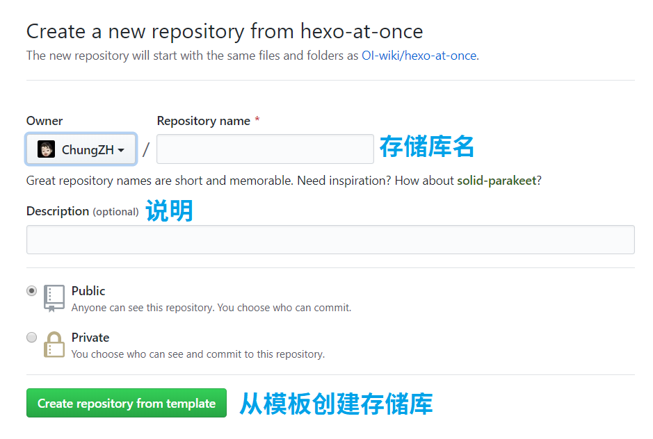
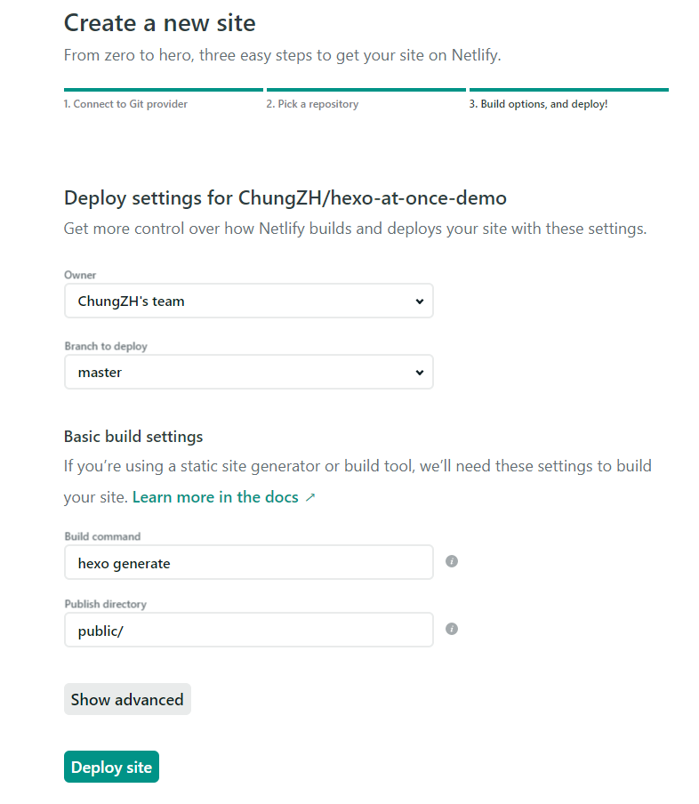
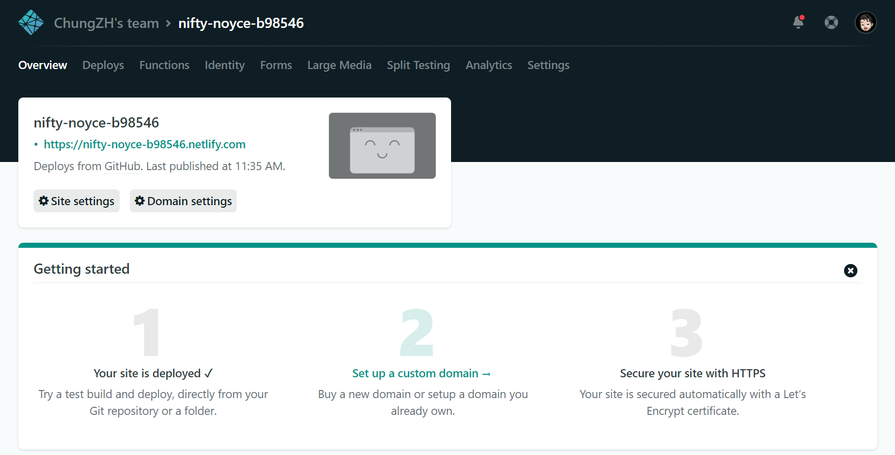

# hexo at once

hexo at once 的目标是帮助 OIer 更方便地记笔记、写博客，让使用者不用关心其它东西，专注于写文章。

[Demo](https://hexo-at-once.netlify.com)

## 特性

- 使用 [hexo-theme-icarus](https://github.com/ppoffice/hexo-theme-icarus) 主题，美观、简洁
- 支持 Mathjax
- 支持 RSS
- 接近“开箱即用”，只需极少配置
- 使用 Markdown 写作
- ······

## 快速开始

### 1. 创建博客存储库

1. 打开 [hexo-at-once](https://github.com/OI-wiki/hexo-at-once) 项目仓库。
2. 点击 Use this template。
   
3. 从模板创建存储库。 
    

这样，你就创建好博客的存储库了！

### 2. 配置博客

可在 `./_config.yml` 和 `./themes/icarus/_config.yml` 中进行配置。

前者是整个 Hexo 的配置文件，文档可见 [官方文档](https://hexo.io/zh-cn/docs/configuration)。

后者是 hexo-theme-icarus 的主题配置文件，可见 [EasyHexo: hexo-theme-icarus](https://easyhexo.com/2-Theme-use-and-config/2-12-hexo-theme-icarus/) 中的文档。

### 3. 配置 Netlify

Netlify 是一个可以部署静态网站的平台，也可以从 GitHub/GitLab/Bitbucket 的项目中快速构建你的网站。相比 GitHub Pages 更加专业、便捷，即使在国内的访问速度也不错。

1. 首先打开 [Netlify 官网](https://www.netlify.com/)，用 GitHub 帐号登录。
2. 点击 **New site from Git**，进入 **Create a new site** 页面。
   1. **Connect to Git provider** 页面，选择 GitHub。
   2. **Pick a repository** 页面，选择你刚刚创建的博客存储库。
   3. 最后一步 **Build options, and deploy!**，Netlify 会检测到是 Hexo 项目，自动配置好了。点击 **Deploy site** 按钮即可。
   

最后出现如下界面：

可以看到 Netlify 自动分配了一个域名，在这个网站中是 `https://nifty-noyce-b98546.netlify.com`。

如果你有自己的域名并想要绑定它，请点击 **Set up a custom domain** 链接。这里不再赘述，详细步骤请见 [Netlify Docs: custom-domains](https://www.netlify.com/docs/custom-domains)。

关于 HTTPS 的设置，Netlify Docs 中也有详细教程。请自行阅读。

### 4. 写作

写作使用 Markdown 语言，在 `./source/_posts` 目录下创建 Markdown 文件并编写即可。

> 关于 Markdown，如果你还不太了解，可见 [教程](https://juejin.im/post/5c1cd16de51d4563d9206173)。

---

最后，如有疑问，可提 issue。

欢迎 PR。

---

如果你想了解更多 Hexo 相关内容，可前往 [EasyHexo](https://github.com/EasyHexo/Easy-Hexo)。

---

💡 Maintained by [ChungZH](https://github.com/ChungZH).